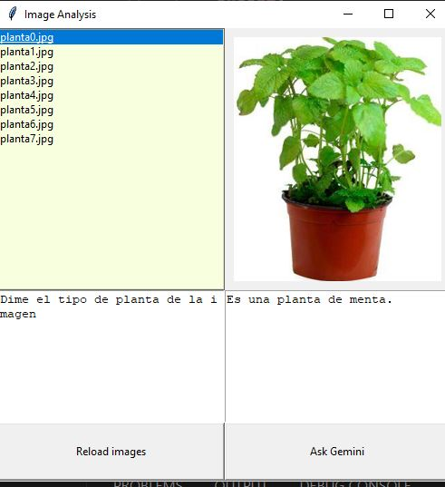

# ¿Que es Gemini-Kike?

Es un programa que se conecta a la IA de google para pasarle una imagen y que te la describa.

# Development

1. Escribe en el cmd: pip install requirements.txt

2. Ve a https://ai.google.dev/ y crea una API Key, crear un archivo en la raiz que se llame key.py y dentro:

clave="TU_API_KEY_QUE_TE_HA_DADO_GOOGLE"

3. Para crear el ejecutable escribe en el cmd: 
python -m PyInstaller --windowed --onefile --icon=logo.ico --splash splash.png --hidden-import=pyi_splash --clean -y -n "gemini-kike"  .\main.py

